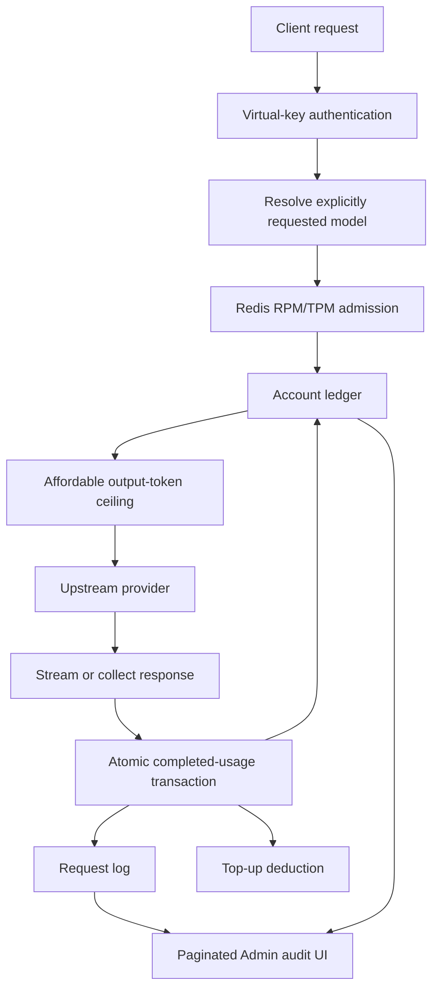

# Muhiya Gateway Full Integration Audit and Remediation

**Audit date:** 2026-07-28  
**Audited code:** Go gateway, PostgreSQL migrations and data-access layer, Redis limiter/affinity integration, proxy billing flow, Admin API, and embedded Admin UI  
**Schema source:** the supplied PostgreSQL schema dump (schema and row-shape analysis only; secrets were intentionally excluded from this report)

## Executive summary

The gateway was not suffering from one isolated Admin UI problem. Its most damaging defect was a repeated PostgreSQL protocol misuse: several functions executed a second statement on a transaction/connection while a prior `Rows` result remained open. With PostgreSQL/libpq this can fail the second query, abort a transaction, or return incomplete Admin data. The pattern existed in settlement overage calculation, user listing, plan listing, and dashboard statistics.

The settlement instance was the highest-severity failure. The former reservation path could fail before the request-log insert, ledger debit, and authorization closure. This directly explained the supplied schema state in which authorizations existed while the account ledger had no corresponding entries and recent requests were absent from request logs. The reservation architecture has now been removed completely by migration 029.

The Admin UI also represented an older architecture. It fetched only the newest 100 logs, filtered them in the browser, displayed time without date, retained an automatic-router screen after automatic routing had been removed, and did not expose account ledger entries, reset history, model catalog metadata, or model pricing tiers.

This remediation unifies those surfaces:

- Completed-usage logging, top-up charging, and ledger insertion now complete atomically without nested result-set queries or monetary holds.
- Admin request logs have a count/page API, bounded inputs, stable ordering, server-side filters, pagination controls, and full timestamps.
- User/plan/dashboard queries fully consume and close result sets before dependent queries. User-list hydration is bulk-loaded instead of issuing several round trips per user.
- Billing operations are visible in the Admin UI: completed-usage ledger entries and usage resets.
- Model base data, catalog metadata, cache contract, and pricing tiers save in one transaction and are editable in the Admin UI.
- The obsolete automatic-routing Admin screen and controls are removed; migration 027 normalizes all legacy routing tiers to `none`.
- Budget and rate-limit admission failures are now recorded as zero-cost request-log rows.
- User and plan Admin mutations immediately invalidate limiter definition caches.
- Production Compose configuration fails closed when Redis is missing by default.

## Audited execution flow

## Schema-to-code integration map

| Schema authority | Runtime writer/reader | Admin exposure | Status after remediation |
|---|---|---|---|
| `users` | `db/db.go`, `proxy/limiter.go` | Users tab | Wired; mutations invalidate limiter definitions |
| `plans`, `budget_windows` | `db/db.go`, `db/billing_atomic.go` | Plans tab | Wired; settled request logs are the usage authority |
| `user_topups` | `db/db.go`, `db/billing_atomic.go` | User top-up modal | Wired; exact nano-USD settlement remains authoritative |
| `usage_resets` | `db/billing.go` | Billing Operations tab | Wired; nonexistent user reset now returns 404 |
| `account_ledger` | `db/billing_atomic.go` | Billing Operations tab | Wired and observable |
| `request_logs` | `db/db.go`, `proxy/handler.go` | Request Logs tab | Paginated, searchable, full timestamp |
| `model_catalog_metadata` | `db/db.go`, `proxy/catalog.go` | Model modal | Transactionally wired |
| `model_pricing_tiers` | `db/db.go`, `pricing/pricing.go` | Model modal | Transactionally wired |
| Redis RPM/TPM state | `proxy/limiter.go` | Operational behavior | Atomic Lua enforcement; production fail-closed default |
| Redis provider affinity | `proxy/affinity.go` | Internal cache behavior | Optional and isolated from monetary authority |

## Detailed findings and implemented fixes

### F-01 — Settlement transaction could abort before logging

- **Severity:** Critical
- **Category:** Billing integrity / PostgreSQL correctness
- **Affected component:** Former `db/reservations.go` settlement path
- **Root cause:** A spending query was executed inside a loop while budget-window `Rows` remained active on the same transaction.
- **Impact:** Successful provider requests could remain unlogged, never create ledger entries, and never deduct top-ups. Stranded authorizations could also make an account appear out of credits without any completed usage.
- **Fix:** The reservation subsystem, reconciler, schema, Admin surface, and request-log links were removed. `SettleUsageAndLog` atomically records completed usage and top-up/ledger changes under a brief per-user transaction lock.
- **Complexity:** Medium
- **Priority:** P0
- **Verification:** Atomic-billing, migration-removal, active-generation-guard, and full Go suites.

### F-02 — User, plan, and dashboard endpoints returned errors or partial data

- **Severity:** High
- **Category:** Admin API / database reliability
- **Affected component:** `db/db.go:ListUsers`, `ListPlans`, `GetDashboardStats`
- **Root cause:** The same open-`Rows`/nested-query pattern and swallowed hydration errors.
- **Impact:** Empty Admin tables, missing usage, “connecting”/generic failures, and misleading partial user records.
- **Fix:** Explicit result consumption/closure and `rows.Err()` checks; hydration errors are returned. User list usage/top-ups are now bulk-loaded.
- **Complexity:** Medium
- **Priority:** P0

### F-03 — Request-log “history” was only the latest 100 records

- **Severity:** High
- **Category:** Auditability / Admin UX
- **Affected component:** `admin/handlers.go:handleLogs`, `db/db.go:ListRequestLogsPage`, `static/app.js:loadLogs`
- **Root cause:** Although an offset parameter existed, the UI hardcoded `limit=100`, performed client-only filters, and had no total-count contract.
- **Impact:** Administrators could not inspect older incidents. Filtering falsely implied that no matching historical rows existed.
- **Fix:** Page envelope (`items`, `total`, `page`, `page_size`), bounded page size, parameterized server filters, owner-name search, stable `(created_at, id)` ordering, Previous/Next controls, and 25/50/100 page sizes. Legacy array responses remain for existing service consumers.
- **Complexity:** Medium
- **Priority:** P0

### F-04 — Log timestamps omitted the calendar date

- **Severity:** Medium
- **Category:** Admin UX / incident response
- **Affected component:** `static/app.js:renderLogs`, `static/index.html`
- **Root cause:** `toLocaleTimeString()` was used in the table.
- **Impact:** Rows from different days were indistinguishable during incident review.
- **Fix:** Full localized year, month, day, hour, minute, and second plus semantic `<time datetime="...">`.
- **Complexity:** Low
- **Priority:** P0

### F-05 — Billing operations were operationally invisible

- **Severity:** High
- **Category:** Observability
- **Affected component:** `account_ledger`, `usage_resets`; Admin API/UI
- **Root cause:** Migrations added backend authorities but no Admin endpoints or views.
- **Impact:** Operators could not verify completed-usage ledger idempotency or audit resets.
- **Fix:** `db/admin_operations.go`, `/api/operations`, and Billing Operations UI tables.
- **Complexity:** Medium
- **Priority:** P0

### F-06 — Model saves left catalog metadata and pricing tiers stale

- **Severity:** High
- **Category:** Model catalog / client synchronization
- **Affected component:** `db/db.go:CreateModel`, `UpdateModel`, `model_catalog_metadata`, `model_pricing_tiers`
- **Root cause:** Base-model CRUD wrote only `models`; metadata had a separate helper and pricing tiers had no write path.
- **Impact:** `/v1/muhiyacode/models` could publish metadata different from the Admin UI, incorrect long-context pricing could be used, and cache contracts could remain stale.
- **Fix:** Base row, metadata, and tier replacement now share one PostgreSQL transaction. Validation covers cache-contract JSON, health enum, positive compatibility epoch, exact non-negative pricing, and ordered unique thresholds. Admin fields expose every catalog/tier property.
- **Complexity:** High
- **Priority:** P0

### F-07 — Automatic-routing UI survived removal of automatic routing

- **Severity:** High
- **Category:** Conflicting architecture / dead code
- **Affected component:** Admin Router tab, routing-tier form/table, router statistics JavaScript/CSS
- **Root cause:** The inference path was simplified earlier, but the UI and persisted tier metadata were not retired with it.
- **Impact:** Operators could configure fields that no longer controlled inference and believe the gateway might switch models.
- **Fix:** Router tab replaced by Billing Operations; routing controls and dead router UI logic removed. Admin and DB saves force `routing_tier='none'`; migration 027 cleans existing rows.
- **Complexity:** Medium
- **Priority:** P0

### F-08 — Limit and budget rejections disappeared from request logs

- **Severity:** High
- **Category:** Request accounting / supportability
- **Affected component:** `proxy/handler.go`
- **Root cause:** Logging began only after successful admission.
- **Impact:** A user could report repeated 402/429/503 responses while the Admin log showed no requests.
- **Fix:** Chat, Anthropic, and transcription admission failures create zero-cost rows with the request ID, model, client, token estimate, status, and cause.
- **Complexity:** Medium
- **Priority:** P1

### F-09 — Plan/user Admin edits did not immediately affect limiter definitions

- **Severity:** Medium
- **Category:** Cache coherence
- **Affected component:** `proxy/limiter.go:limiterDefsCache`, Admin mutation handlers
- **Root cause:** Definition caching had only TTL expiration and no invalidation hook.
- **Impact:** Plan reassignment and RPM/TPM edits could use stale definitions for several seconds.
- **Fix:** `RateLimiter.InvalidateUser/InvalidateAll` are connected to user, plan, and budget mutation handlers. Settled spend always bypasses this cache.
- **Complexity:** Medium
- **Priority:** P1

### F-10 — Legacy charge-watermark state outlived its billing design

- **Severity:** High
- **Category:** Top-up correctness
- **Affected component:** Former `user_window_charge_state`
- **Root cause:** Plan updates deleted/recreated budget-window IDs, while legacy watermark rows had no window foreign key.
- **Impact:** Stale watermarks could suppress or distort later top-up charging and grow indefinitely.
- **Fix:** Migration 029 removes the obsolete watermark table. Completed request logs and atomic marginal-overage settlement no longer require a persistent watermark.
- **Complexity:** Medium
- **Priority:** P1

### F-11 — Usage reset reported success for nonexistent users

- **Severity:** Medium
- **Category:** API semantics / audit integrity
- **Affected component:** `db/billing.go:ResetUserUsage`, Admin handler
- **Root cause:** Rows affected were not checked before inserting reset history.
- **Impact:** False success responses and reset audit entries with no corresponding user.
- **Fix:** Zero affected rows returns `sql.ErrNoRows`; API maps it to 404 and does not insert history.
- **Complexity:** Low
- **Priority:** P1

### F-12 — Plan deletion and invalid configuration produced opaque failures

- **Severity:** Medium
- **Category:** Admin UX / validation
- **Affected component:** plan handlers and CRUD
- **Root cause:** No assignment guard, weak validation, and no row-existence check.
- **Impact:** FK errors surfaced as generic failures; duplicate/zero-duration windows could enter unsafe paths.
- **Fix:** Plan validation, unique durations, positive window duration, non-negative limits/budgets, 404 for missing plans, and 409 when users are still assigned.
- **Complexity:** Low
- **Priority:** P1

### F-13 — Production could silently fall back to per-process rate limits

- **Severity:** High in multi-replica deployments
- **Category:** Redis / distributed correctness
- **Affected component:** `proxy/limiter.go`, `docker-compose.yml`
- **Root cause:** `REQUIRE_REDIS` defaulted to empty/false.
- **Impact:** Each replica could independently admit the full RPM/TPM allowance.
- **Fix:** Compose now defaults `REQUIRE_REDIS=true`. The existing atomic Redis Lua script remains the distributed source of truth; Redis failure produces a retryable infrastructure response instead of over-admission. Local single-instance deployments may explicitly set false.
- **Complexity:** Low
- **Priority:** P0 for production

### F-14 — Several list functions ignored terminal row-iteration errors

- **Severity:** Medium
- **Category:** Error handling
- **Affected component:** providers, virtual keys, budgets, top-ups, settings, key-hash backfill
- **Root cause:** Successful `Scan` iterations were treated as proof that the entire result completed.
- **Impact:** Network/protocol failures near the end of a result could return truncated lists as successful.
- **Fix:** `rows.Err()` is checked consistently.
- **Complexity:** Low
- **Priority:** P1

### F-15 — Raw internal database errors could reach Admin callers

- **Severity:** Medium
- **Category:** Security / API hygiene
- **Affected component:** dashboard and logs handlers
- **Root cause:** Direct `err.Error()` responses.
- **Impact:** Schema/query details could leak and UI behavior was inconsistent.
- **Fix:** Internal details are logged server-side; callers receive a stable generic error.
- **Complexity:** Low
- **Priority:** P1

### F-16 — Fresh installs seeded active providers with fake API keys

- **Severity:** High
- **Category:** Secure defaults / misleading readiness
- **Affected component:** `db/db.go:seedDefaults` and legacy SQL bootstrap scripts
- **Root cause:** Placeholder `mock-*-key` credentials and their models were inserted as active production records.
- **Impact:** A fresh gateway advertised models that could never authenticate upstream, causing avoidable provider retries and false “active” status.
- **Fix:** Placeholder credentials were removed. Bootstrap providers and models are inactive until an administrator supplies a real credential, tests it, and activates the records.
- **Complexity:** Low
- **Priority:** P0 for fresh deployments

## PostgreSQL and Redis reliability assessment

PostgreSQL is the monetary authority. Exact nano-USD columns, settled request logs, brief per-user advisory transaction locks, ledger idempotency keys, and completed-usage transactions are the foundation. There is no pending monetary state. Statement, lock, and connect timeouts in `main.go:postgresSafetyParams` prevent indefinite pool starvation.

Redis is correctly limited to throughput enforcement and MiniMax/OpenRouter affinity. It does not own balances. RPM/TPM enforcement uses a single Lua script, so prune/count/admit/write is atomic. Production now fails closed when distributed limiting is unavailable. Provider affinity remains optional because losing affinity affects cache efficiency, not billing authority.

## Remaining operational constraints

These are deployment properties, not disconnected code:

1. `REDIS_URL`, `DATABASE_URL`, `ADMIN_PASSWORD`, and a stable `PROVIDER_KEY_ENCRYPTION_KEY` must be supplied in Elest.io.
2. Existing plaintext provider keys remain rollout-compatible when encryption is unset, but public launch should set the key and rotate provider credentials.
3. The in-memory immediate retry queue is not durable across process death. Runtime completions settle actual usage atomically; exact crash-time provider cost reconciliation would require a durable outbox or provider usage API. The Redis active-generation key is non-monetary and expires automatically after a hard crash.
4. Offset pagination satisfies full history navigation. At very large log volumes, the next evolution should be cursor/keyset pagination using the new `(created_at, id)` index.

## Validation performed

- `go test ./...`
- `go build ./...`
- `node --check static/app.js`
- `git diff --check`
- Added DB-free tests for parameterized request-log filters, MiniMax catalog/cache defaults, malformed cache contracts, and plan-window validation.
- Existing exact-money, cache-regression, limiter, relay-billing, catalog, and wire-golden suites continue to pass.

## Production verification checklist

- [ ] `/health` reports `status=ok`, migration count includes migration 027, and `billing_loss=0`.
- [ ] Redis startup log reports distributed limiter connected; with Redis intentionally unavailable, inference fails closed.
- [ ] Create one low-cost request and verify one request log and one debit ledger entry share the request identifier.
- [ ] Trigger a budget denial and verify a 402 zero-cost request-log row.
- [ ] Trigger RPM denial and verify a 429 zero-cost request-log row.
- [ ] Change a user’s plan and verify the next request uses new RPM/TPM values.
- [ ] Reset one user and verify both usage display and reset history.
- [ ] Add, expire, and soft-delete top-ups; verify remaining balance changes immediately.
- [ ] Save a MiniMax model with a cache contract and >512k tier; reload the modal and `/v1/muhiyacode/models` and verify identical metadata.
- [ ] Traverse log pages, apply search/status/model filters, and verify full dates.
- [ ] Restart the process during a request and verify the non-monetary Redis generation guard expires without creating fake usage.

## Definition of done

The gateway is ready for public launch when all production checklist items pass against the Elest.io PostgreSQL and Redis instances, `billing_loss` remains zero under restart/fault testing, every successful generation produces an actual-usage request-log/ledger chain, all denials are visible, Admin mutations take effect on the next request, and the Admin UI can read and modify every schema-backed product feature without hidden legacy routing behavior.
